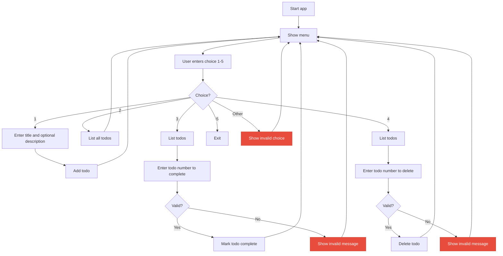

# Git It Together - Git Learning Project

A simple Todo application designed to help you practice common git commands.

## User Workflow



## Project Structure

```
.
├── main.py       # Main entry point for the application
├── todo.py       # Core Todo and TodoList classes
├── utils.py      # Utility functions (file I/O, formatting)
└── README.md     # This file
```

## Setup

1. Make sure you have uv installed
   ```bash
   brew install uv
   ```
2. Clone or navigate to this repository
3. Run the application:
   ```bash
   uv run main.py
   ```

## Features

- Add todos
- List all todos
- Mark todos as complete
- Simple command-line interface

## Learning Git with This Project

This codebase is intentionally simple so you can focus on learning git. Here are some practice scenarios:

### Basic Commands
- `git status` - Check what files have changed
- `git add` - Stage changes
- `git commit` - Save changes
- `git log` - View commit history
- `git diff` - See what changed

### Branching
- `git branch` - List/create branches
- `git checkout` - Switch branches
- `git merge` - Combine branches
- `git rebase` - Reapply commits

### Undoing Changes
- `git reset` - Unstage changes
- `git revert` - Create a new commit that undoes changes
- `git checkout -- <file>` - Discard changes in a file

## Suggested Practice Exercises

1. **Make a feature branch** - Create a branch to add a new feature (like saving todos to a file)
2. **Make commits** - Make small, logical commits as you work
3. **Merge your branch** - Merge your feature back into main
4. **Fix a bug** - Create a hotfix branch, fix a bug, and merge it
5. **Explore history** - Use `git log` and `git show` to explore past commits

## Tips

- Make small, focused commits
- Write clear commit messages
- Use branches for different features
- Practice often!

Happy learning! 🚀

